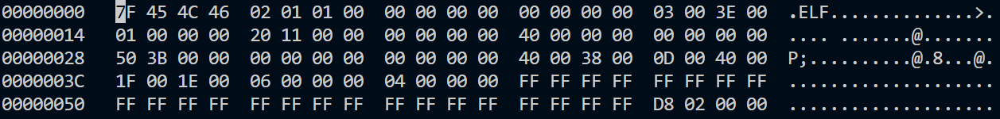
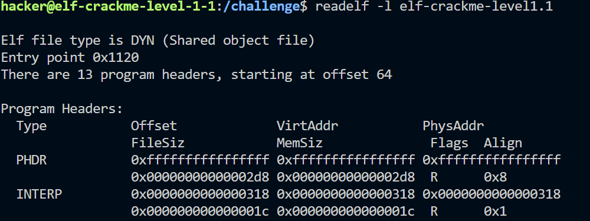

# Level1.1

### 1.关卡目的：学习并理解程序头表

### 2.步骤

- 使用hexedit查看elf文件内容，`hexedit elf-crackme-level1.1`

- 发现从0x48-0x5F的值都是0xFF，很明显发现不正确。
- 使用readelf查看elf程序头表，`readelf -l elf-crackme-level1.1`。

- 从读取结果可以看出PHDR段的数据很明显不正确，通过计算，正确的值应当如下

  |  Offset  | 0x0000000000000040 |
  | :------: | :----------------: |
  | VirtAddr | 0x0000000000000040 |
  | PhysAddr | 0x0000000000000040 |

- 使用修改脚本逐一修改，然后执行elf文件得到flag