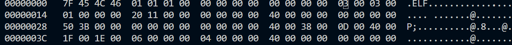
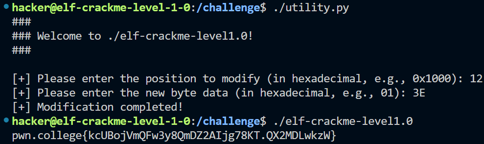

# Level 1.0

### 1.关卡目的:学习并理解 ELF 文件头

### 2.步骤

- 使用hexedit查看elf文件头信息`hexedit elf-crackme-level1.0` 

  

- 分析可以得知前16字节，也就是`e_ident` 值没有问题，继续查看发现`e_type` 也没有问题，继续检查`e_machine` 的值，发现是03。

- 查看[对应表](https://refspecs.linuxfoundation.org/elf/gabi4+/ch4.eheader.html)可知03对应的是`Intel 80386` 处理器，结合题意要求理解x64机器和x86机器的区别，考虑将`e_machine`的值改为x64机器。

- 再次查看[对应表](https://refspecs.linuxfoundation.org/elf/gabi4+/ch4.eheader.html)，选择AMD处理器的值3E填进去。

- 可见二进制文件成功执行，得到flag